# pytorch-generative-model-collections
Original : [[Tensorflow version]](https://github.com/hwalsuklee/tensorflow-generative-model-collections)

Pytorch implementation of various GANs.

This repository was re-implemented with reference to [tensorflow-generative-model-collections](https://github.com/hwalsuklee/tensorflow-generative-model-collections) by [Hwalsuk Lee](https://github.com/hwalsuklee)

I tried to implement this repository as much as possible with [tensorflow-generative-model-collections](https://github.com/hwalsuklee/tensorflow-generative-model-collections), But some models are a little different.

This repository is included code for CPU mode Pytorch, but i did not test. I tested only in GPU mode Pytorch.

## Dataset
- GAN, LSGAN, WGAN, WGAN_GP, DRAGAN, EBGAN, BEGAN used dataset of the torchvision.
- infoGAN, ACGAN, CGAN used dataset downloaded from MNIST (http://yann.lecun.com/exdb/mnist/) and fashion-MNIST (https://github.com/zalandoresearch/fashion-mnist).

## Difference from [tensorflow-generative-model-collections](https://github.com/hwalsuklee/tensorflow-generative-model-collections)
- This repository does not have WGAN-GP and Variational Auto-Encoders.
- DRAGAN : The DRAGAN loss calculation method is different.
- ACGAN : The learning procedure is different.
- EBGAN : MSE is used instead of L2 norm and the last layer of discriminator does not use sigmoid activation function.
- BEGAN : L1 norm is used instead of L2 norm and the last layer of discriminator does not use sigmoid activation function.

## Generative Adversarial Networks (GANs)
### Lists (Table is borrowed from [tensorflow-generative-model-collections](https://github.com/hwalsuklee/tensorflow-generative-model-collections))

*Name* | *Paer Link* | *Value Function*
:---: | :---: | :--- |
**GAN** | [Arxiv](https://arxiv.org/abs/1406.2661) | 
**LSGAN**| [Arxiv](https://arxiv.org/abs/1611.04076) | 
**WGAN**| [Arxiv](https://arxiv.org/abs/1701.07875) | 
**WGAN_GP**| [Arxiv](https://arxiv.org/abs/1704.00028) | 
**DRAGAN**| [Arxiv](https://arxiv.org/abs/1705.07215) | 
**CGAN**| [Arxiv](https://arxiv.org/abs/1411.1784) | 
**infoGAN**| [Arxiv](https://arxiv.org/abs/1606.03657) | 
**ACGAN**| [Arxiv](https://arxiv.org/abs/1610.09585) | 
**EBGAN**| [Arxiv](https://arxiv.org/abs/1609.03126) | 
**BEGAN**| [Arxiv](https://arxiv.org/abs/1703.10717) |   

#### Variants of GAN structure (Figures are borrowed from [tensorflow-generative-model-collections](https://github.com/hwalsuklee/tensorflow-generative-model-collections))


### Results for mnist
Network architecture of generator and discriminator is the exaclty sames as in [infoGAN paper](https://arxiv.org/abs/1606.03657).  
For fair comparison of core ideas in all gan variants, all implementations for network architecture are kept same except EBGAN and BEGAN. Small modification is made for EBGAN/BEGAN, since those adopt auto-encoder strucutre for discriminator. But I tried to keep the capacity of discirminator.

The following results can be reproduced with command:  
```
python main.py --dataset mnist --gan_type <TYPE> --epoch 25 --batch_size 64
```

#### Fixed generation
All results are generated from the fixed noise vector.

*Name* | *Epoch 1* | *Epoch 10* | *Epoch 25* | *GIF*
:---: | :---: | :---: | :---: | :---: |
GAN | 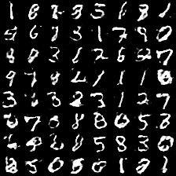 | 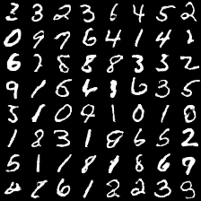 | 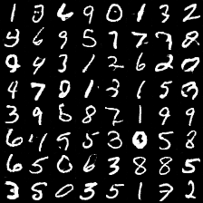 | 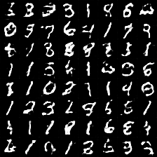
LSGAN | 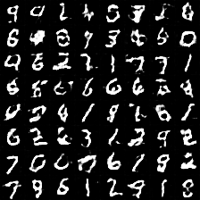 | 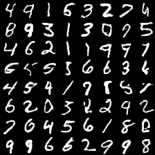 | 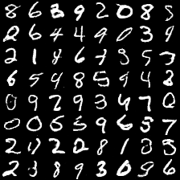 | 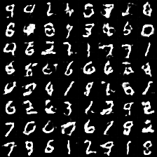
WGAN | 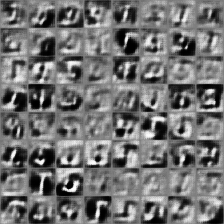 | 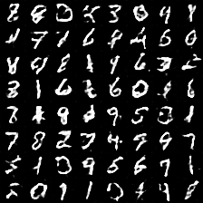 | 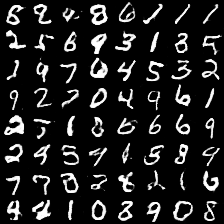 | 
WGAN_GP |  | 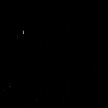 | 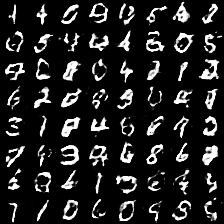 | 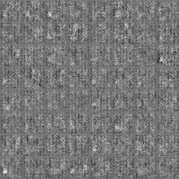
DRAGAN | 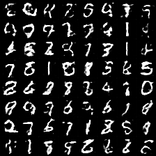 |  | 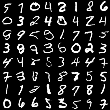 | 
EBGAN | 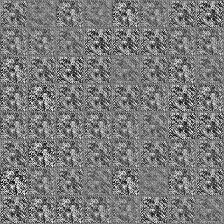 | 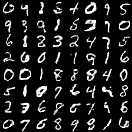 | 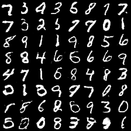 | 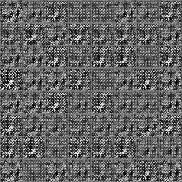
BEGAN | 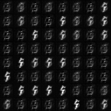 | 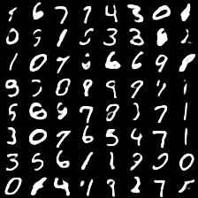 | 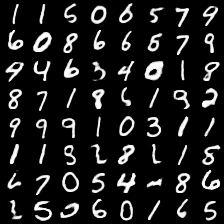 | 

#### Conditional generation
Each row has the same noise vector and each column has the same label condition.

*Name* | *Epoch 1* | *Epoch 10* | *Epoch 25* | *GIF*
:---: | :---: | :---: | :---: | :---: |
CGAN |  | 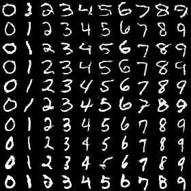 | 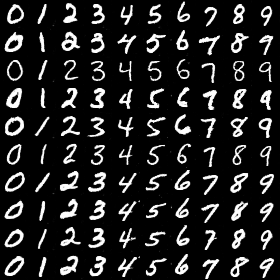 | 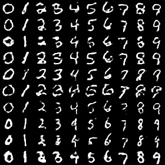
ACGAN | 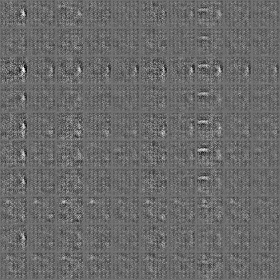 | 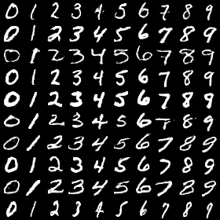 | 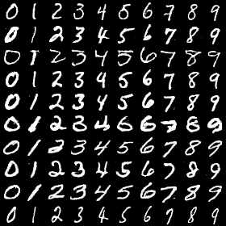 | 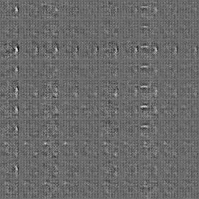
infoGAN | 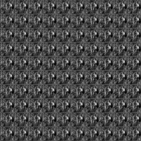 | 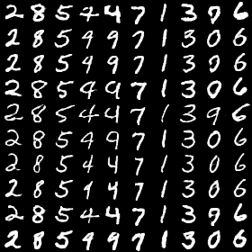 | 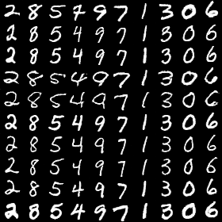 | 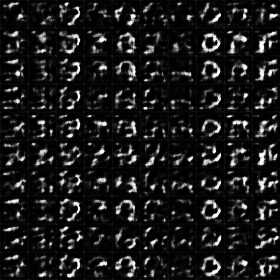

#### InfoGAN : Manipulating two continous codes
All results have the same noise vector and label condition, but have different continous vector.

*Name* | *Epoch 1* | *Epoch 10* | *Epoch 25* | *GIF*
:---: | :---: | :---: | :---: | :---: |
infoGAN | 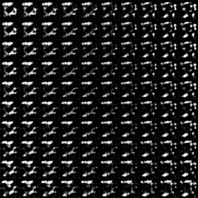 | 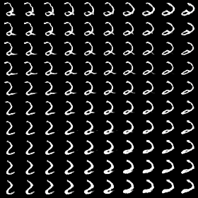 | 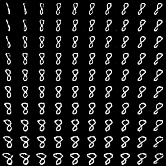 | 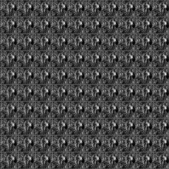

#### Loss plot

*Name* | *Loss*
:---: | :---: |
GAN | 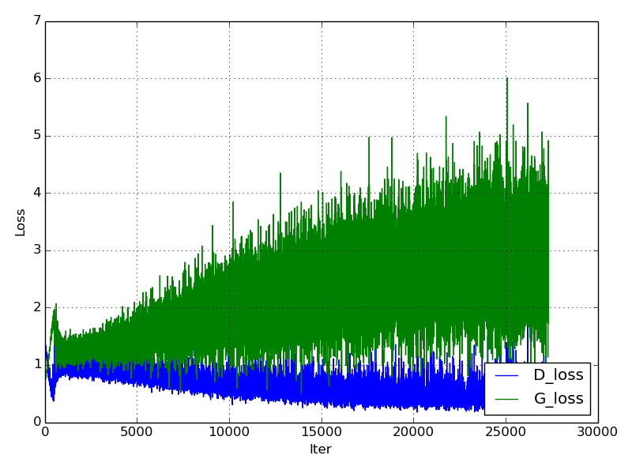
LSGAN | 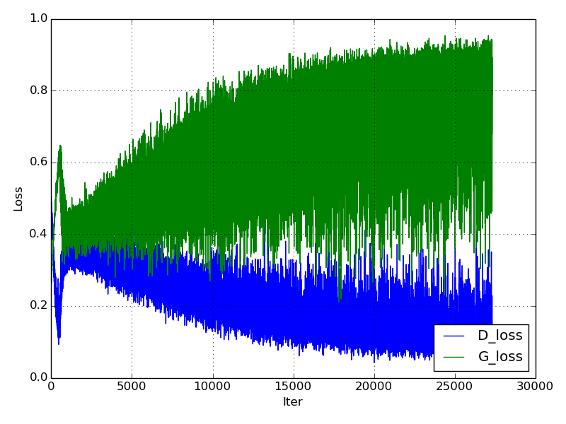
WGAN | 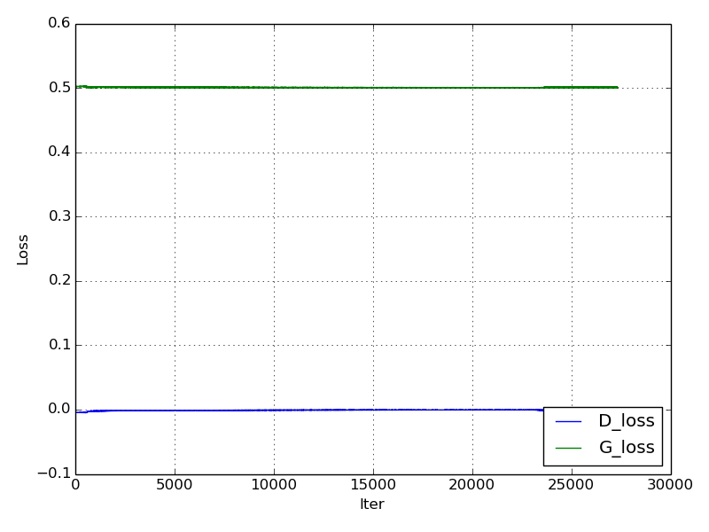
WGAN_GP | 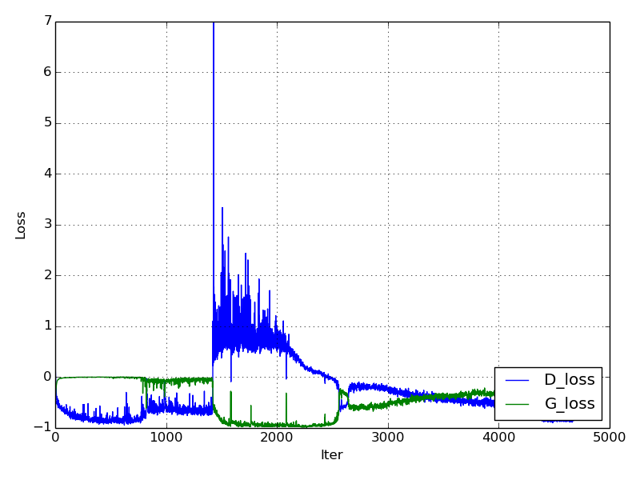
DRAGAN | 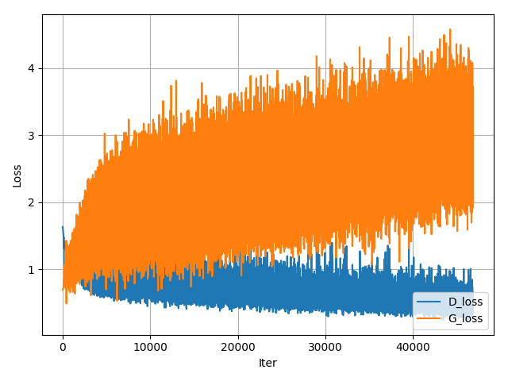
EBGAN | 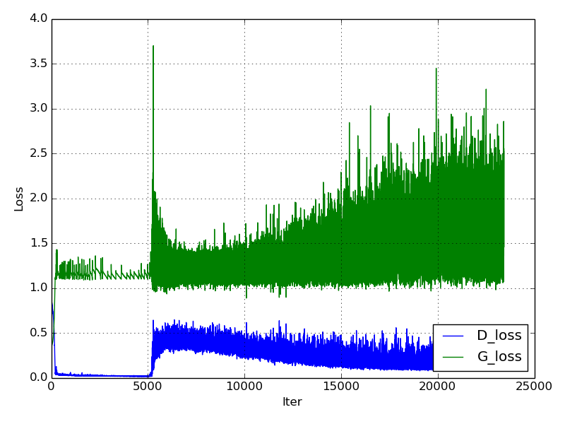
BEGAN | 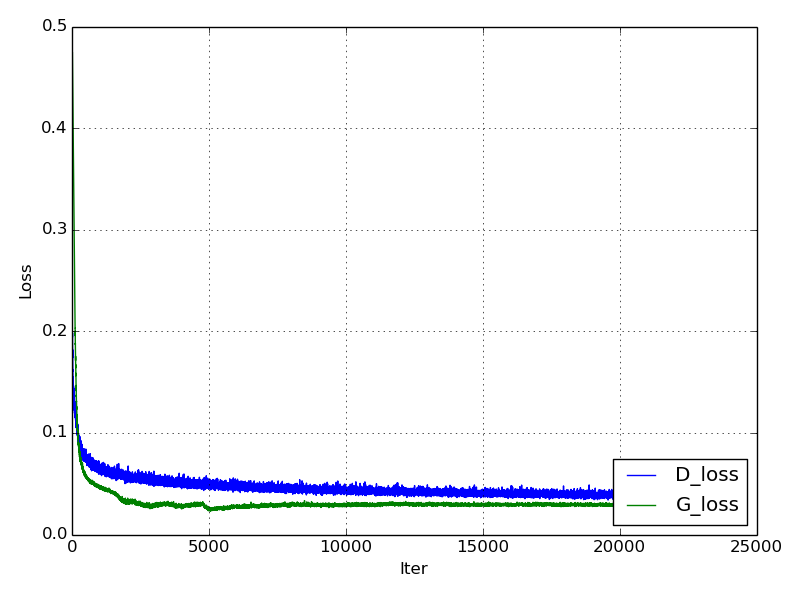
CGAN | 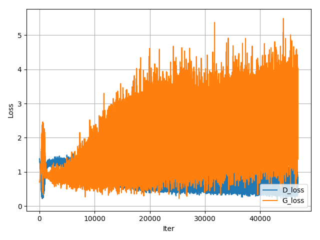
ACGAN | 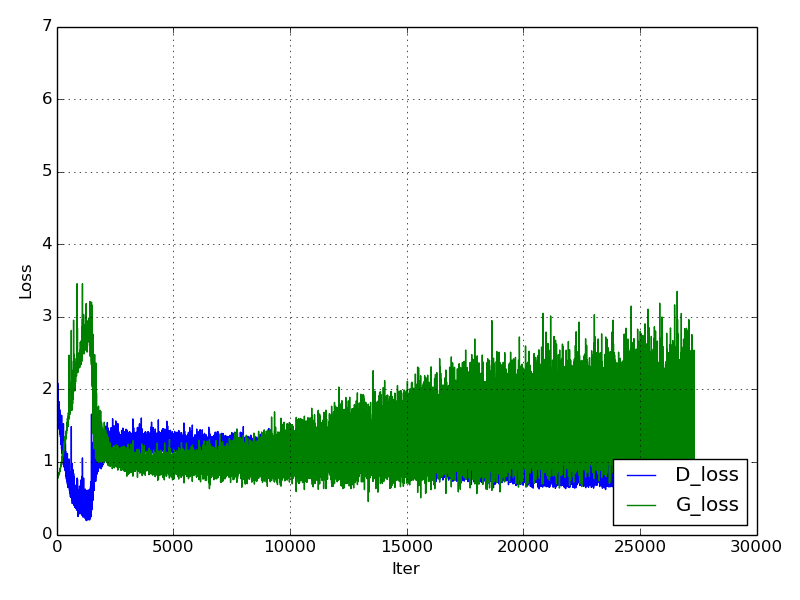
infoGAN | 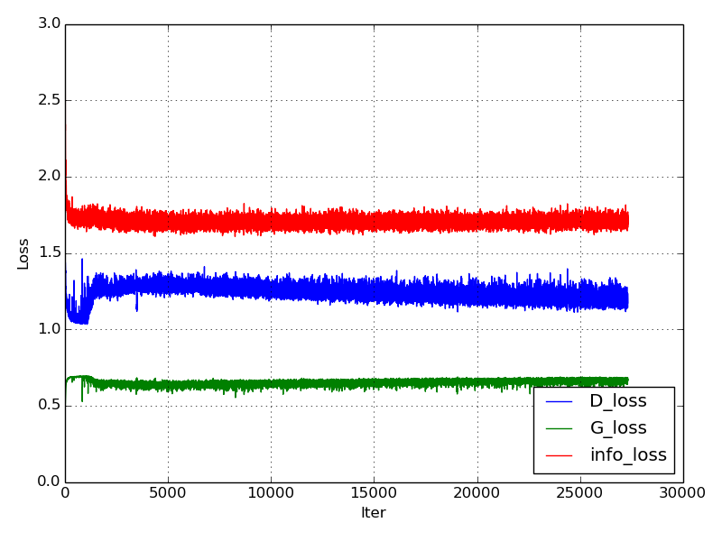

### Results for fashion-mnist
Comments on network architecture in mnist are also applied to here.  
[Fashion-mnist](https://github.com/zalandoresearch/fashion-mnist) is a recently proposed dataset consisting of a training set of 60,000 examples and a test set of 10,000 examples. Each example is a 28x28 grayscale image, associated with a label from 10 classes. (T-shirt/top, Trouser, Pullover, Dress, Coat, Sandal, Shirt, Sneaker, Bag, Ankle boot)

The following results can be reproduced with command:  
```
python main.py --dataset fashion-mnist --gan_type <TYPE> --epoch 25 --batch_size 64
```

#### Fixed generation
All results are generated from the fixed noise vector.

*Name* | *Epoch 1* | *Epoch 10* | *Epoch 25* | *GIF*
:---: | :---: | :---: | :---: | :---: |
GAN |  | 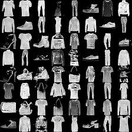 | 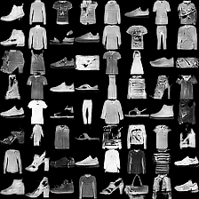 | 
LSGAN |  |  |  | 
WGAN |  |  |  | 
WGAN_GP |  |  |  | 
DRAGAN |  |  |  | 
EBGAN |  |  |  | 
BEGAN |  |  |  | 

#### Conditional generation
Each row has the same noise vector and each column has the same label condition.

*Name* | *Epoch 1* | *Epoch 10* | *Epoch 25* | *GIF*
:---: | :---: | :---: | :---: | :---: |
CGAN |  |  |  | 
ACGAN |  |  |  | 
infoGAN |  |  |  | 

- Without hyper-parameter tuning from mnist-version, infoGAN does not work well as compared with CGAN/ACGAN.  
- ACGAN tends to fall into mode-collapse in [tensorflow-generative-model-collections](https://github.com/hwalsuklee/tensorflow-generative-model-collections), but Pytorch ACGAN does not fall into mode-collapse.
- infoGAN tends to ignore noise-vector. It results in that various style within the same class can not be represented.

#### InfoGAN : Manipulating two continous codes
All results have the same noise vector and label condition, but have different continous vector.

*Name* | *Epoch 1* | *Epoch 10* | *Epoch 25* | *GIF*
:---: | :---: | :---: | :---: | :---: |
infoGAN |  |  |  | 

#### Loss plot

*Name* | *Loss*
:---: | :---: |
GAN | 
LSGAN | 
WGAN | 
WGAN_GP | 
DRAGAN | 
EBGAN | 
BEGAN | 
CGAN | 
ACGAN | 
infoGAN | 

### Results for celebA (It will be update soon)
celebA dataset tested in GAN, LSGAN, WGAN, WGAN_GP, DRAGAN, EBGAN, BEGAN. Each sample was resized 64x64.

#### Fixed generation
All results are generated from the fixed noise vector.

*Name* | *Epoch 1* | *Epoch 10* | *Epoch 25* | *GIF*
:---: | :---: | :---: | :---: | :---: |
GAN |  |  |  | 
LSGAN |  |  |  | 
WGAN |  |  |  | 
WGAN_GP |  |  |  | 
DRAGAN |  |  |  | 
EBGAN |  |  |  | 
BEGAN |  |  |  | 

- Without hyper-parameter tuning from mnist-version.
- For WGAN_GP, BEGAN, and EBGAN, celebA shows low performance as compared with MNIST/fashion-MNIST. I guess the reason is that they are used the same network architecture as MNIST/fashion-MNIST. I'm not sure, but maybe the network capacity is not enough for celebA.

## Folder structure
The following shows basic folder structure.
```
├── main.py # gateway
├── data
│   ├── mnist # mnist data (not included in this repo)
│   |   ├── t10k-images-idx3-ubyte.gz
│   |   ├── t10k-labels-idx1-ubyte.gz
│   |   ├── train-images-idx3-ubyte.gz
│   |   └── train-labels-idx1-ubyte.gz
│   ├── fashion-mnist # fashion-mnist data (not included in this repo)
│   |   ├── t10k-images-idx3-ubyte.gz
│   |   ├── t10k-labels-idx1-ubyte.gz
│   |   ├── train-images-idx3-ubyte.gz
│   |   └── train-labels-idx1-ubyte.gz
│   └── celebA # celebA data (not included in this repo)
│       └──celebA
│          ├── 000001.jpg
│          ├── ...
│          ├── ...
│          └── 202599.jpg
├── GAN.py # vainilla GAN
├── utils.py # utils
├── models # model files to be saved here
└── results # generation results to be saved here
```

## Development Environment
* Ubuntu 14.04 LTS
* NVIDIA GTX 1080 ti
* cuda 8.0
* Python 2.7.6
* pytorch 0.2.0+5585c26
* torchvision 0.1.9
* numpy 1.13.1
* matplotlib 1.3.1
* imageio 2.2.0
* scipy 0.19.1

## Acknowledgements
This implementation has been based on [tensorflow-generative-model-collections](https://github.com/hwalsuklee/tensorflow-generative-model-collections) and tested with Pytorch on Ubuntu 14.04 using GPU.

